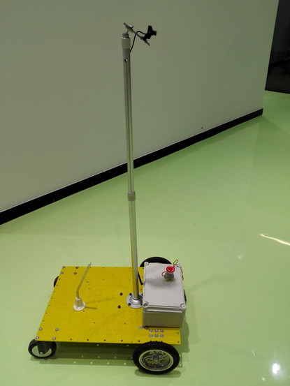

# 汪自强

## 项目经历一 **_建图机器人_**
**简介**：使用四轮机器人底盘，开发基于lsd-slam的地图构建验证平台，用于自动构建无人驾驶导航地图，编写机器人的视觉建图、定位、运动控制软件  

**成果展示**：

1.[提取车道线视频](http://v.youku.com/v_show/id_XMzA4Nzc4MDM0MA==.html?spm=a2h3j.8428770.3416059.1)　　

2.[室内SLAM视频](http://v.youku.com/v_show/id_XMzA4NzczNjQxMg==.html?spm=a2h3j.8428770.3416059.1)　　

3.[室内SLAM地图视频](http://v.youku.com/v_show/id_XMzA4NzczNzk3Ng==.html?spm=a2h3j.8428770.3416059.1)　

4.[室外SLAM地图视频](http://v.youku.com/v_show/id_XMzA4NzczODgyOA==.html?spm=a2h3j.8428770.3416059.1)

5.室外地图

# 项目经历二　**_仓储物流机器人_**

**简介**：仓储叉车机器人商用产品，开发两种类型的机器人，在嵌入式平台上基于ROS开发定位功能，得到在已有仓库地图中的位置信息，使用A*算法进行路径规划，然后CPU通过CAN总线控制电机动作，完成机器人的导航任务。

1.Freight（搬运机器人）,负责驮着货物从分货处运送到仓库的货架附近。

2.Fretch（叉车机器人），在货架附近活动，负责将到来的Freight上的货物搬运到货架上。

**成果展示：**

1.[叉车巡线视频](http://v.youku.com/v_show/id_XMzA4NzcwMDE2NA==.html?spm=a2h3j.8428770.3416059.1)

**_2013全国大学生飞思卡尔智能车竞赛_**

智能车

## [决赛比赛视频](http://v.youku.com/v_show/id_XMzA4NzgzODg4MA==.html?spm=a2h3j.8428770.3416059.1) 

# 项目经历二
**_2016Robomaster机甲大师赛_**

麦克纳姆轮机器人

## [比赛视频](http://v.youku.com/v_show/id_XMzA4Nzg1NjE4OA==.html?spm=a2h3j.8428770.3416059.1) 

## 项目经历三

